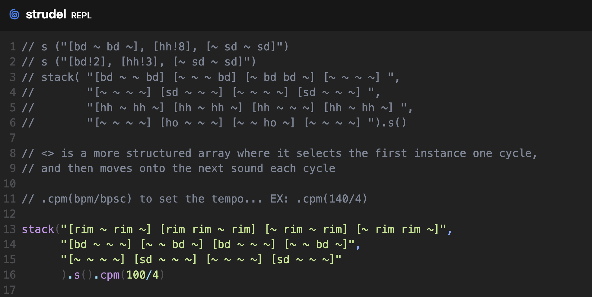
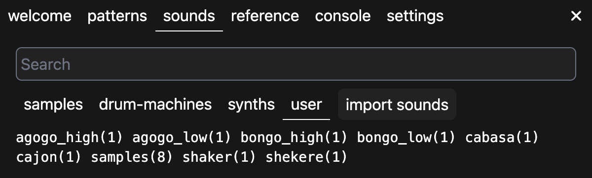
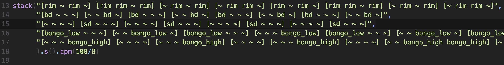
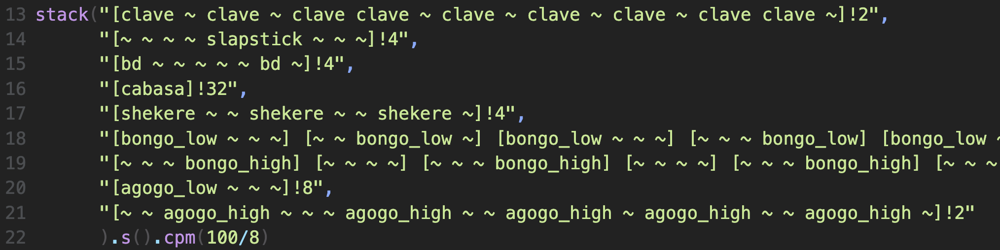
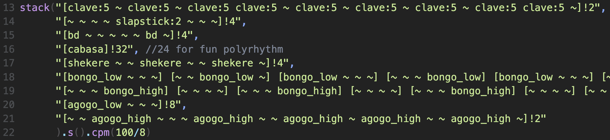

# First Strudel Patch

Before breaking down my process, here's the final patch I ended up with. I've also uploaded some custom samples that I worked with in my repo for easy access and recreatability:
```javascript
stack("[clave:5 ~ clave:5 ~ clave:5 clave:5 ~ clave:5 ~ clave:5 ~ clave:5 ~ clave:5 clave:5 ~]!2",
      "[~ ~ ~ ~ slapstick:2 ~ ~ ~]!4",
      "[bd ~ ~ ~ ~ ~ bd ~]!4",
      "[cabasa]!32", //24 for fun polyrhythm
      "[shekere ~ ~ shekere ~ ~ shekere ~]!4",
      "[bongo_low ~ ~ ~] [~ ~ bongo_low ~] [bongo_low ~ ~ ~] [~ ~ ~ bongo_low] [bongo_low ~ ~ ~] [~ ~ bongo_low ~] [bongo_low ~ ~ ~] [bongo_low bongo_low ~ ~]",
      "[~ ~ ~ bongo_high] [~ ~ ~ ~] [~ ~ ~ bongo_high] [~ ~ ~ ~] [~ ~ ~ bongo_high] [~ ~ ~ ~] [~ ~ bongo_high bongo_high] [~ ~ ~ ~]",
      "[agogo_low ~ ~ ~]!8",
      "[~ ~ agogo_high ~ ~ ~ agogo_high ~ ~ agogo_high ~ agogo_high ~ ~ agogo_high ~]!2"
      ).s().cpm(100/8)
```

## Process
For this assignment, I wanted to experiment with recreating more humanistic grooves, mostly to expirement and see how strudel handled them. Being of Latino descent, I thought samba grooves would be a great way to test this out, so I incorporated some simple patterns from the music I grew up listening to. When first starting to construct my patch I started by creating a basic outline that looked like this:



I was writing in a way to better visualise 16th subdivision in a 4/4 pattern. This helped me get my ideas out rather quickly as it helped translate my musical knowledge to this syntax much faster.

From here I wanted to incorporate more instruments but had some difficulty finding samples that I felt suited the style of music, so I imported my own samples. I first uploaded them all as `.wav` files under one **"samples"** folder, but had issues accessing the individual samples nested in that folder (indicated by the `samples(8)` in the window below). To combat this, I reuploaded the files with each sample in it's own named sub-folder *(though I discover later on how to access those additional samples).*



As I continued adding parts, I ran into an issue where my patterns were becoming much longer. I did not want to sacrifice the written in variations, so I went to the initial `.cpm(100/4)` value and changed it to `.cpm(100/8)` to account for the change in pattern length. This allowed me to keep the perception of **100bpm** for my patch by assigning the tempo to each eigth note as opposed to each quarter. 



Once happy with the sound of the current patch and after adding a few more additional parts, I started working towards optimisation. I looked for any repeats in patterns and found ways to cut them down by using the **repeat mini-notation.** One thing to note, is that to get the proper repetition this required me to use the `[]` a bit more differently than I had initially. I used them to define a pattern length as opposed to visualising larger beats, relating less to **meters or time signatures** by this point and more so thinking in **sequences** and how to best align them.



Lastly, I wanted to use my remaining time to tackle an issue I had run into earlier on in this process. I was still a bit unhappy with the sound of the clave, as I felt it was too easily buried by the other instruments, and was still unable to access the 8 initial samples I had imported. I took a peak at the official strudel documentation, and discovered I could use `:` after any sound sample to access any additional sounds loaded with it. You can see this demonstrated in the clave line, where I used the fifth sample because it rang more clearly than the others.



Though I didn't go back and edit any of the imported sounds to use this schematic, I made note of this for future assignments. It'll be a much more efficient and organised way to upload samples if I organise them by instrument type, and then load any related samples into that folder. For example, if I were to reformat the imported samples used in this patch, I would do something like this:

- cabasa
  1. cabasa.wav

- shekere
  1. shekere.wav

- bongos
  1. low.wav 
  2. high.wav

- agogo_bells
  1. low.wav
  2. high.wav