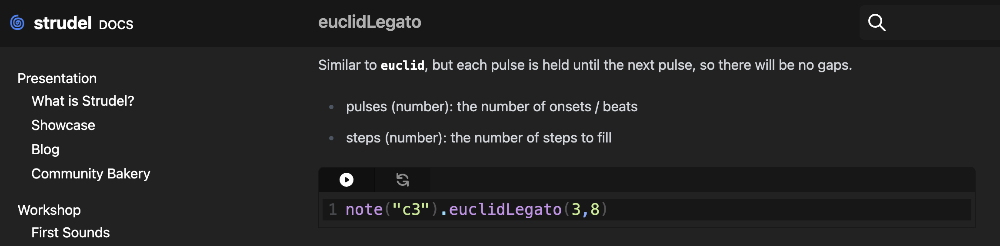
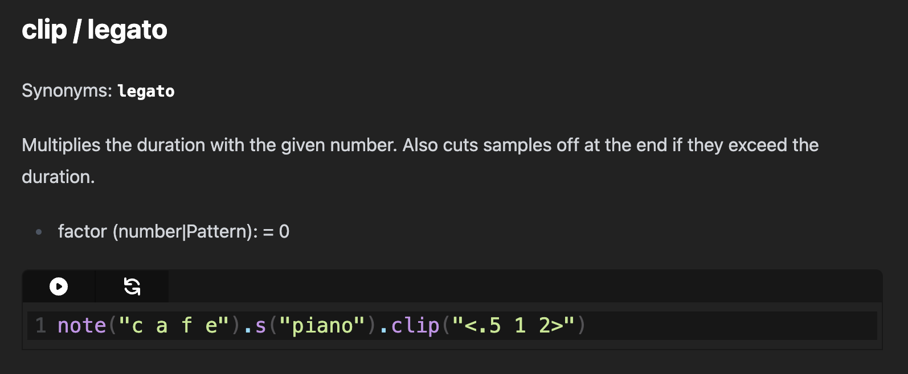
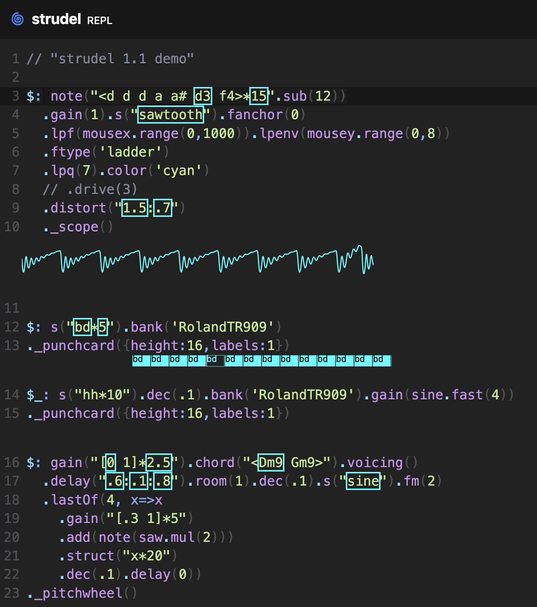

# Second Strudel Patch

Before breaking down my process, here's the final patch I ended up with:
```javascript
$:
n("0 2 4 6 7 8 9 7").scale("Db:major").s("sine")
    .mask("<1 [0 1]>").clip("<4>")
    ._scope()
$: 
note("~ ~ ab3 f3").struct("~ ~ ~ ~ x x x x")
  .mask("<1 [0 0 0 0 0 1 1 1] 1 [0 0 0 1]>")
  .s("triangle")

$: 
note("~ ~ ~ ~ db5 c5 ab4 f4").s("gm_glockenspiel").clip("3")
  .mask("<1 [0 0 0 0 0 1 0 1] 1 [0 0 0 1]>")
  ._pitchwheel()

$:
note("db5,ab4").struct("x ~ x ~ ~ x ~ x ~ ~ ~ x ~ x ~ ~") 
  .slow(2).s("brown")

$:
note("Db2").euclidLegato(3,8).sound("gm_acoustic_bass")
```

## Process
For this assignment, the first thing I wanted to focus on was making sure I caught up with what was covered in class while I was absent. I started by checking the class repository to see what concepts where covered. I copied the patches into **strudel** to see how they behaved and cross-referenced the official [strudel docs](https://strudel.cc/workshop/getting-started/) whenever necessary. 

After doing some catch-up and studying I started actually creating my patch by playing around with note sequences using `n()` and `.scale()`. I ended up building off of this pattern:

```javascript
n("0 2 4 6 7 8 9 7").scale("Db:major").s("sine")
```

From here I wanted to play around a bit with the **euclidian rhythms.** While I liked the example placed in our class repository, I was trying to use this rhythm with a synth bass, and felt like it sounded way too stacatto. After looking through the **strudel documentation** a bit more, I stumbled upon `.euclidLegato()` and `.clip()`. I ended up using `.clip()` for my **sine pattern** for a sustain pedal effect, but kept to `.euclidLegato()` for the bass to prevent any overlap or gaps between each pulse.




I also referenced a demo from the featured pages that I remember really enjoying. I was trying to figure out how to play multiple patterns at once and noticed (between referncing said demo and the strudel documentation), that `$:` could be used to do so. I also discovered you can mute a pattern with `_$:` instead of having to highlight and comment out a section with `command` + `/`.



The demo also introduced me to some fun visualizers like `._scope()` and `._pitchwheel()`, which I decided to add to some of my patterns.

From here, it was just a matter of building up my patch and experimenting with other features that came up in the class repository. With my new patterns, I experimented with `.struct()` and `.mask()`. I used `.struct()` both with a sequence and with a power chord **(Db5)** to see how it behaved with both. 

```javascript
note("~ ~ ab3 f3").struct("~ ~ ~ ~ x x x x")
```

```javascript
note("db5,ab4").struct("x ~ x ~ ~ x ~ x ~ ~ ~ x ~ x ~ ~") 
```

I also had a lot of fun playing around with `.mask()` and seeing how the syntax was interpreted by strudel. I realised that within a cycle `[]` it would use the given amount of characters to essentially "subdivide" the sequence... and depending on whether the character was `0` or `1` (though it seemed to take any other positive integer in the place of `1` as well), it would function like it was returning `true` or `false` for whether the sequence should be playing at that moment. For example, if only two character were given `[0, 1]` the cycle would play for the second half but not the first. I ended up using it in a few patterns, but here's one example:

```javascript
note("~ ~ ~ ~ db5 c5 ab4 f4").s("gm_glockenspiel").clip("3")
  .mask("<1 [0 0 0 0 0 1 0 1] 1 [0 0 0 1]>")
```

Lastly, I just had some fun playing around with the synths used for this, while looking through the strudel documentation, realised I could use noise. I ended up incorporating a little pattern with **brown noise** for a softer sound:

```javascript
note("db5,ab4").struct("x ~ x ~ ~ x ~ x ~ ~ ~ x ~ x ~ ~") 
  .slow(2).s("brown")
```